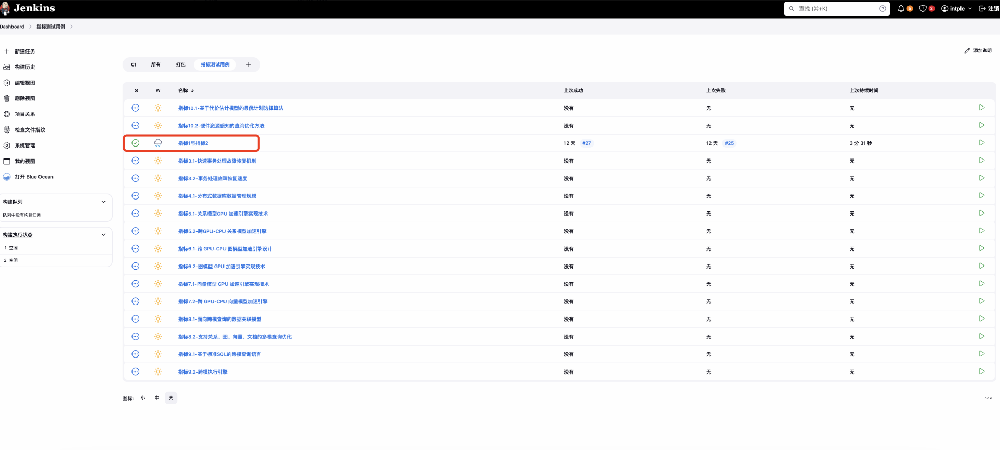

# CI实用指南


## helmDB仓库

**helmDB**：https://e.gitee.com/helmDB/projects/656153/repos


HelmDB仓--server

HelmDB-third_party_binarylibs--依赖+第三方组件

docs--文档仓库 

文档存放在docs仓库，目前已给各个课题建好了文档仓库，放入对应目录下即可

课题1:content/docs-helmdb/zh/docs/class1/

课题2:content/docs-helmdb/zh/docs/class2/

课题3:content/docs-helmdb/zh/docs/class3/

课题4:content/docs-helmdb/zh/docs/class4/

课题5:content/docs-helmdb/zh/docs/class5/

## 文档命名规范


**英文-驼峰法**

**中文-写清楚feature的名字即可**

**不允许带下划线等其他特殊字符**


## mr-commit规范
提交pr的commit格式，需要`committer`审核。

```
--[feature]:[课题][描述]--
--[详细描述]--
```


## 国家重点研发计划-开发规范
### 代码规范
参考OpenGauss 的代码规范。

### 分支管理规范

#### 分支管理概述

本项目基于 OpenGauss 数据库系统开发，采用 Git 作为版本控制系统。为确保开发流程的清晰性与高效性，项目定义了四种主要的分支类型：Main、Dev、Feature、以及 Stage。以下是各分支的具体用途及管理策略：

##### Main 分支
●目的与作用：Main 分支是项目的稳定版本分支，仅包含经过充分测试且已准备好发布的代码。

●更新频率：仅在经过严格测试和所有必要审查后，从 Stage 分支合并稳定的更改。
##### Dev 分支
●目的与作用：Dev 分支是开发主线，包含最新的开发进度。所有功能更新首先在此分支开发并测试。

●管理策略：开发者应定期将此分支的更改合并到各自的 Feature 分支中，以避免冲突。

##### Feature 分支
●目的与作用：从 Dev 分支派生，用于开发特定功能。每个新功能或改进都应在独立的 Feature 分支上进行开发。

●管理策略：功能开发完毕后，通过创建合并请求（Merge Request）将更改合并回 Dev 分支。合并前必须通过持续集成（CI）检查。
##### Stage 分支
●目的与作用：Stage 分支用于模拟生产环境进行长期测试，是将代码更改从 Dev 移至 Main 的中间步骤。

●管理策略：只有在功能稳定且通过所有测试后，更改才会从 Stage 分支合并到 Main 分支。

##### 合并请求与代码审查（MergeRequest）
●合并请求：开发者（主要是学生）可以发起合并请求，但最终合并到 Dev 或 Main 分支的操作必须由项目负责人（教师）完成。

●代码审查：在合并过程中，项目负责人应仔细检查代码的功能实现、代码质量以及遵守代码规范。

**注1：为避免合并冲突，建议不以课题为分支单位过长时间独立开发而不与 Dev 分支同步。**


### 功能开发的完整流程
1.准备阶段

●开发者从 Dev 分支拉取最新的代码。这一步确保开发基于项目的最新进展进行，避免后期合并冲突。

●创建一个新的 Feature 分支，命名规则为 feature/<功能名称>，例如：feature/login-authentication。

2.开发阶段

●在 Feature 分支上进行功能开发。这包括编写代码、进行单元测试和修复在开发中发现的任何bug。

●定期将 Dev 分支的更新合并到 Feature 分支，以保持分支同步。这有助于减少将来合并到 Dev 分支时的复杂性。

3.测试阶段

●完成基本的功能开发后，进行更全面的集成测试，确保新功能与现有系统的兼容性和稳定性。

●修复测试过程中发现的所有问题，确保功能符合预期的质量标准。

4.代码审查与合并

●开发完成后，开发者需要提交一个合并请求（Merge Request）到 Dev 分支。Merge Request 应包括足够的描述，说明所开发功能的目的和主要逻辑。

●项目或课题负责人（通常是教师）进行代码审查。审查重点包括代码的质量、是否符合编码标准、功能是否实现预期效果以及是否可能引入新的问题。

●根据审查结果，可能需要进行一些修改。这一步骤可能会重复几次，直到代码满足所有标准。

5.代码合并

●一旦代码审查通过，并且CI（持续集成）测试没有问题，负责人将合并 Feature 分支到 Dev 分支。

●更新 Dev 分支后，通知项目组成员以便他们可以更新各自的工作环境。

6.文档更新

●更新项目文档和用户手册以反映新增功能。这对于保持项目文档的准确性和最新状态至关重要。

### MergeRequest 规范


### Git 常见使用规范

Git 作为目前最流行的版本控制系统，为了确保代码库的整洁、高效和安全，有一些通用的使用规范需要遵守。以下列举一些常见的 Git 使用规范：

一、 提交相关规范
1.原子性提交 (Atomic Commits): 每次提交应该只包含一个逻辑上的修改。避免将多个不相关的修改放在一起提交，方便后续代码审查和版本回溯。

2.清晰的提交信息 (Clear Commit Messages):

●使用简洁明了的语言描述本次提交的目的和内容。

●第一行作为简要概括，不超过 50 个字符，使用祈使语气，首字母大写，结尾不加句号，首个单词和分支管理规范一样，标明当前的commit 的作用，例如feature、bugfix等

●空一行后，可以添加更详细的解释，说明修改的原因、实现方式等。

●例如：
```
Bugfix: 修复用户登录失败的问题用户登录时
密码验证逻辑错误导致登录失败。本次提交修改了密码验证逻辑，确保用户可以正常登录。
```

3.避免提交未使用的代码 (Don't Commit Unused Code): 删除不再使用的代码，保持代码库简洁。

4.提交前进行代码格式化 (Format Code Before Committing): 保持代码风格一致性，提高代码可读性。

5.提交前进行代码测试 (Test Code Before Committing): 确保提交的代码质量，避免引入新的错误。

6.不要提交编译后的文件 (Don't Commit Compiled Files): 编译后的文件可以通过源码生成，无需纳入版本控制，避免代码库臃肿。

二、 分支相关规范

1.使用分支进行开发 (Develop in Branches): 避免直接在主分支 (例如 main 或 master) 上进行开发，使用功能分支、修复分支等进行开发，完成后再合并到主分支。

2.分支命名规范 (Branch Naming Conventions): 使用清晰、简洁、易于理解的分支名称，例如 feature/user-login、fix/bug-123 等。常见的前缀有： feature: 新功能、bugfix: 修复 bug、docs: 文档的变更。

3.及时合并分支 (Merge Branches Regularly): 避免分支长时间不合并导致代码冲突和集成困难。

4.删除已合并的分支 (Delete Merged Branches): 保持分支列表简洁，避免产生过多分支。


三、 文件相关规范
1..gitignore 文件的使用: 配置 .gitignore 文件，忽略不需要版本控制的文件和目录，例如编译后的文件、日志文件、本地配置文件等。目前项目根目录下已经配置好对应的gitignore 文件，如果项目课题组有需要，可以在自己的目录下新建.gitignore 文件。如果修改全局的.gitignore文件，则需要考虑对已有文件及其他课题的影响。

2.避免上传大文件 (Avoid Large Files): Git 不适合管理大文件，例如图片、视频、音频等。如果需要管理大文件，可以考虑使用 Git LFS (Large File Storage) 等工具。

3.二进制文件处理 (Handling Binary Files): 尽量避免将二进制文件直接提交到 Git 仓库，因为二进制文件难以进行版本比较和合并。如果必须提交，建议使用 Git LFS 或其他专门管理二进制文件的工具。


### API 文档模板模板和示例

我们采用protobuf管理API接口。以下是API 的接口规范文档。

##### API接口规范

API接口规范分为两个部分。 其一是Protobuf 文件中，包含有所有的接口定义.其次是在Docs下，应对每个接口都维护一个文档。
如下是Docs 下，每个对应接口的文档模板
1. 文档概述
```
●版本: v1.0
●编写日期: 2024-05-30
●作者: 作者姓名-单位
●修改记录:
●2024-05-30: 初始版本
●2024-06-10: 增加了错误处理部分
```
2. 接口概览
```
●接口名称: GetUser
●接口功能描述: 根据用户ID获取用户信息
```
3. Protobuf 定义
```
syntax = "proto3";
package userapi;
// 用户请求信息
message UserRequest {  
    int64 user_id = 1; // 用户的ID
    }
// 用户响应信息 
message UserResponse {  
    int64 user_id = 1; // 用户的ID  
    string name = 2; // 用户姓名  
    string email = 3; // 用户邮箱  
    int32 age = 4; // 用户年龄  
    repeated string roles = 5; // 用户角色列表
    }
// 定义服务 
service UserService {  
    rpc GetUser(UserRequest) 
    returns (UserResponse);
    }
Copy
```
4. API 详细说明
4.1 请求参数
```
●UserRequest
●user_id (int64): 请求查询的用户的唯一标识符。
```
4.2 响应参数
```
●UserResponse
●user_id (int64): 用户的ID。
●name (string): 用户的姓名。
●email (string): 用户的电子邮件地址。
●age (int32): 用户的年龄。
●roles (string[]): 用户的角色列表。
```
4.3 错误处理

●无效请求: 如果请求缺少必要的 user_id 或 user_id 不存在，返回错误。

5. 使用示例

5.1 请求示例
```
json
复制
{ "user_id": 12345}
Copy
```

5.2 响应示例
```
json
复制
{"user_id": 12345,
"name": "张三",
"email": "zhangsan@example.com",
"age": 30,
"roles": ["管理员", "用户"]
}
Copy
```

7. 版本兼容性

●当前版本: v1.0

●向后兼容性: 本接口保证与v1.0之前的版本兼容。


### 需求分析文档模版

功能需求分析文档

1. 功能概述

1.1 功能名称

简明扼要地指出功能的名称。

1.2 功能目的

描述开发此功能的主要目的和它如何支持业务或技术的总体目标。

1.3 功能背景

提供此功能提出的背景，包括它解决的具体技术指标和技术挑战。

2. 功能描述

2.1 功能作用

详细描述功能的作用和它将如何影响现有系统。

2.2 功能意义

阐述此功能对于用户或系统的重要性，包括它带来的益处。

3. 用户角色和权限

3.1 用户角色

定义将与此功能交互的不同用户角色，谁使用这个功能。

4. 功能需求

4.1 详细功能点

列出并详细描述功能的所有主要组成部分和功能点。

4.2 功能流程

通过流程图或步骤列表详细说明用户如何使用该功能，包括每个步骤的预期结果。

5. 非功能需求

5.1 性能要求

为确保功能性能，列出具体的性能指标，如响应时间、处理速度等。

5.2可用性要求

有一些功能对系统的高可用有一定的要求，可以列出对系统可用性的帮助。

6. 验收标准

6.1 测试场景

详细列出功能必须通过的关键测试场景。

6.2 详细测试方案

根据4 中的功能说明，5中的提到的非功能性要求以及关键测试场景，细化测试方案，并按照测试方案在研发过程中进行测试。

其他项目成员方便后续根据项目的描述，和测试方案的描述，对功能有详细的了解，以及功能的完备程度有更详细的了解。

6.3 验收条件

定义功能完成时必须满足的条件。

7. 附录

7.1 参考资料

提供参考资料列表，以支持需求分析的深入理解。可能包括其他系统相关的参考文档，论文等内容。


## 如何使用ci门禁
CI地址（外网）：http://103.233.162.227:10025/

CI地址（内网）：http://172.16.11.241:54323/

CI门禁：http://172.16.11.241:54323/view/CI/job/CI%E9%97%A8%E7%A6%81-Github/view/change-requests/

**开发tips：每个分支都需要拉主线（main分支）的jenkinsfile，这样才能在合入代码的时候跑CI门禁，只有CI门禁通过才允许pr合入。**


CI门禁里的测试内容：编译打包、openGauss原生测试用例、各课题组自己新增的单元测试用例、code check（这个暂时目前还没有内容，但是接口已留）。


此处当提交pr想要merge时，就会触发ci门禁，分支对应的就是pr号（pr-id），状态是绿色即通过，则找committer合入即可，若状态是红色，则为不通过，点击最新一次结果，即可看到失败在哪一步。以下图为例：


失败在openGauss test这一步，可以通过点开shell script查看日志，


可以发现是fast-check没有通过。

那么需要在本地环境跑通fast-check，完成修改后再重跑ci门禁。在这里对pr的修改不用关闭该pr，直接修改，然后在jenkins重新执行即可。


由于提交pr时ci门禁自动触发，那么对应的在pr下也会有对应结果显示。
这是失败的效果

此处可以看见结果为checks失败，通过点击Details可以跳转到Jenkins详情页，登陆即可查看对应的信息。（此处后面还会做修改，会通过ci-run指令来简化用法）。
这是成功的效果


如何查看自己的pr号


## 如何新增fastcheck自测用例
当前ci门禁中指定了自测用例都放在src/test/regress目录下，测试用例放在src/test/regress/sql目录下，用例的预期放在src/test/regress/expected目录下。用例名和预期名一致。


然后将该测试用例补充到src/test/regress/parellel_schedule

可以选择test: testcase_name这种格式添加到文件中，也可以将用例testcase_name 添加到对应的测试模块后面。


运行
make fastcheck_single

自己本地调通再提pr。

## 如何增加新功能的自测用例
不用修改流水线，将测试用例合入到fastcheck即可。

课题指标的测试用例如何搭建流水线
目前我们已经给大家建好了流水线，大家不用自己搭建流水线，只需要将测试脚本和使用方法放到对应课题的目录下即可。已为大家建好目录。这边上传好后@孙维芳，引跑会负责给大家适配流水线。
```
课题1:src/test/regress/intple/class1
课题2:src/test/regress/intple/class2
课题3:src/test/regress/intple/class3
课题4:src/test/regress/intple/class4
课题5:src/test/regress/intple/class5
```


以课题1为例，目前课题1已经将指标1和指标2对应的测试脚本放到对应目录下，引跑这边收到消息会根据测试脚本去适配不同的流水线。



可以观察健康状态来获取指标测试的运行结果


绿色代表脚本执行成功，红色表示失败。

如何自己搭建jenkins部署流水线

**禁止在公用jenkins上部署流水线。**

## 安装jenkins（仅供大家本地调试用）
环境：centos

安装
```
yum install yum-fastestmirror -y 
sudo wget -O /etc/yum.repos.d/jenkins.repo http://jenkins-ci.org/redhat/jenkins.repo`
sudo rpm --import http://pkg.jenkins-ci.org/redhat/jenkins-ci.org.key
yum install jenkins               #install jenkins
```

启动

```
sudo service jenkins start
#如果不能sudo
visudo
#把这句话加进去即可
user ALL=(ALL) NOPASSWD: ALL
```


访问
浏览器输入`http://your server ip:8080/`

更改配置（如端口）方式
```
vim /etc/sysconfig/jenkins
sudo service jenkins restart
```

jenkins基础配置

经过上面的配置，你可以访问你的Jenkins了，在浏览器中输入：`http://your server ip:8080/`

按照提示我们执行`cat /var/lib/jenkins/secrets/initialAdminPassword`得到`Administrator password`，输入后点击Continue，选择`install suggested plugins`，等待安装完毕，如果有安装失败的可以跳过，之后可以手动根据需求安装。

然后设置一下初始账户和密码，设置完成后进入界面。

Github配置sercret text

注：此处需要一个对项目有写权限的账户
> 进入github --> setting --> Developer Settings --> Personal Access Token --> token(classic) --> Generate new token

按照这个勾选，就能生成所需要的token了。自己先保存此`token`，如果丢失，之后再也无法找到这个`token`。

GitHub webhooks 设置
> 进入GitHub上指定的项目 --> setting --> WebHooks&Services --> add webhook --> 输入刚刚部署jenkins的服务器的IP

jenkins的github配置
安装GitHub Plugin
>系统管理-->插件管理-->可选插件

直接安装Github Plugin, jenkins会自动帮你解决其他插件的依赖，直接安装该插件Jenkins会自动帮你安装plain-credentials 、git 、 credentials 、 github-api。
配置GitHub Plugin

>系统管理 --> 系统设置 --> GitHub --> Add GitHub Sever
Credentials点击Add添加，Kind选择Secret Text,Secret填写前面生成的token

设置完成后，点击`TestConnection`,提示`Credentials verified for user UUserName, rate limit: xxx`,则表明有效。
创建一个freestyle任务

●-General 
设置勾选github项目，然后填写GitHub project URL, 也就是你的项目主页

●-配置源码管理
1. 填写项目的git地址, eg. `https://github.com/your_name/your_repo_name.git`
2. 添加github用户和密码
3. 选择githubweb源码库浏览器，并填上你的项目URL，这样每次构建都会生成对应的changes，可直接链到github上看变更详情

●-构建触发器，构建环境

●-build steps：将测试脚本可以填写在这个地方。

●-构建后操作

最后点击保存即可。

测试

测试该流水线是否符合预期。

## docker
```
docker run -d -p 8080:8080 centos-jenkins-bak（这里的端口映射换成自己的）
docker ps
docker exec -it container_id /bin/bash
```
大家可以通过这种方式来获取测试环境

## git rebase
```
git remote add upstream git@github.com:New-Hardware-DB/HELMDB.git
git fetch upstream main
git rebase upstream/main
```


