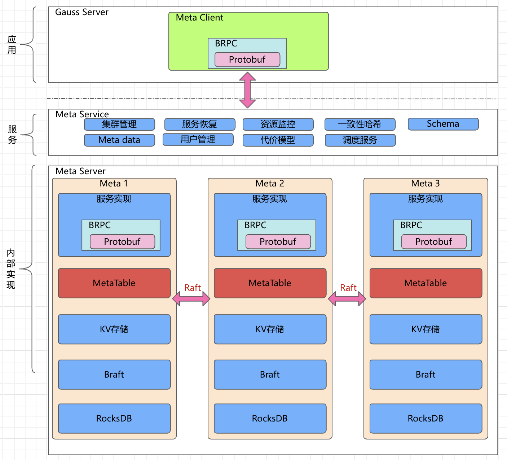
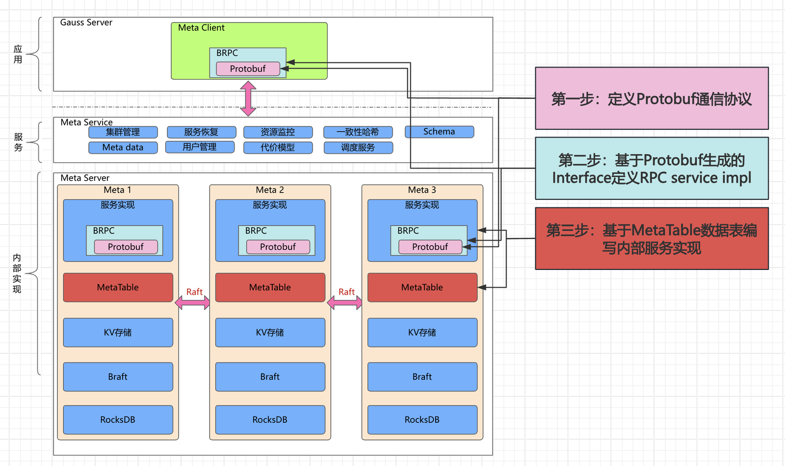

# Meta使用指南
## Meta架构



## Meta使用示例

这边以课题二的资源监控需求为例，说明使用meta的流程概括来讲，使用meta中心化管理和操作数据需要三步

**1.定义protobuf通信协议**

**2.编写server代码**

**3.编写client代码**




### 1.定义protobuf通信协议

protobuf是Google开源的一种语言无关的数据序列化协议，meta使用protobuf来定义客户端和服务端的通信接口。


首先在`meta/proto`文件夹下创建`task2.proto`文件，protobuf的代码规范和教程可以参考[protobuf.md](./protobuf.md)和[https://protobuf.dev](https://protobuf.dev)

添加必要的文件头
```protobuf
syntax="proto3";

package meta;
```
添加服务数据结构，*注：应为每个课题定义一个RPC服务*
```protobuf
service Task2Service {

}
```

然后添加数据结构的定义
```protobuf
// 节点负载信息
message NodeLoadInfo {
    uint8 cpuUsage=1; 
    uint8 mem_usage=2;
    uint8 pmem_usage=3;
    uint8 ssd_usage=4;
}
```

添加rpc请求和响应的数据结构
```protobuf
message UpdateNodeLoadInfoRequest {
    uint64 id = 1;
    uint64 timestamp= 2;
    NodeLoadInfo nodeLoadInfo = 3;
}

message UpdateNodeLoadInfoResponse {
    uint64 id = 1; 
    string message = 2;
}
```

添加RPC方法定义到service中
```protobuf
service Task2Service {
    rpc UpdateNodeLoadInfo(UpdateNodeLoadInfoRequest) returns (UpdateNodeLoadInfoResponse);
}
```

总的`task_2.proto`如下
```protobuf
syntax="proto3";

package meta;

option cc_generic_services = true;

// The task2 service definition
service Task2Service {
    rpc UpdateNodeLoadInfo(UpdateNodeLoadInfoRequest) returns (UpdateNodeLoadInfoResponse);
}

// 节点负载信息
message NodeLoadInfo {
    uint8 cpuUsage=1; 
    uint8 mem_usage=2;
    uint8 pmem_usage=3;
    uint8 ssd_usage=4;
}

message UpdateNodeLoadInfoRequest {
    uint64 id = 1;
    uint64 timestamp= 2;
    NodeLoadInfo nodeLoadInfo = 3;
}

message UpdateNodeLoadInfoResponse {
    uint64 id = 1; 
    string message = 2;
}
```

### 编译protobuf
重新编译`meta`，`meta/proto`文件夹下将会出现同名的C++定义文件`task_2.pb.cc`和`task_2.pb.h`

### 编写server端逻辑
在`meta/include/meta_server`下创建`resource_manager.h`，内容如下
```cpp
#pragma once

#include <map>
#include <memory>
#include "proto/task_2.pb.h"
#include "common.h"

class ResourceManager {
public:
    static ResourceManager& instance();
    uint64_t register_server(const Server& server);

private:
    ResourceManager();
    std::map<ServerID, meta::NodeLoadInfo> nodeLoadInfo;
};
```

在`meta/src/meta_server`下编写`resource_manager.cpp`
```cpp
#include "resource_manager.h"

ResourceManager& ResourceManager::instance() {
    static ResourceManager instance;
    return instance;
}

ResourceManager::ResourceManager() {
}

uint64_t ResourceManager::update_node_load_info(ServerID server_id, const NodeLoadInfo& NodeLoadInfo)
{
    nodeLoadInfoMap[server_id] = NodeLoadInfo;
    return 0;
}

```

在`meta/include`下定义服务实现`task2_service_impl.h`
```cpp
#pragma once
#include "proto/task_2.pb.h"
#include "resource_manager.h"
#include "brpc/server.h"

using meta::Task2Service;

class Task2ServiceImpl : public Task2Service {
public:
    virtual ~Task2ServiceImpl();
    static Task2ServiceImpl *get_instance()
    {
        static Task2ServiceImpl _instance;
        return &_instance;
    }

    void UpdateNodeLoadInfo(google::protobuf::RpcController *cntl_base, const meta::UpdateNodeLoadInfoRequest *request,
                            meta::UpdateNodeLoadInfoResponse *response, google::protobuf::Closure *done) override;
};
```

在`meta/src/meta_server`下编写服务实现`task2_service_impl.cpp`

```cpp
#include "task2_service_impl.h"

Task2ServiceImpl::~Task2ServiceImpl()
{}

void Task2ServiceImpl::UpdateNodeLoadInfo(google::protobuf::RpcController *cntl_base,
                                         const meta::UpdateNodeLoadInfoRequest *request, meta::UpdateNodeLoadInfoResponse *response,
                                         google::protobuf::Closure *done)
{
    brpc::ClosureGuard done_guard(done);
    auto server_id = request->id();
    auto node_load_info = request->nodeloadinfo();
    ResourceManager::instance().update_node_load_info(server_id, node_load_info);
    response->set_id(server_id);
}
```

在`meta/src/meta_server/main.cpp`中添加服务
```cpp
    if (server.AddService(&task2_service_impl, brpc::SERVER_DOESNT_OWN_SERVICE) != 0) {
        LOG(ERROR) << "Failed to add service";
        return -1;
    }
```
meta状态的持久化和故障恢复的设计见 5.

### 编写client逻辑
`meta/meta_client/include/meta_client.h`中
```cpp
#include "task_2.pb.h" // 引入头文件

// 使用proto request和response定义
using meta::UpdateNodeLoadInfoRequest; 
using meta::UpdateNodeLoadInfoResponse;

class MetaClient {
public:
    ...
    uint64_t UpdateNodeLoadInfo(); // 添加方法定义
    ...
}
```

在`meta/meta_client/src/meta_client.cpp`中填写实现
```cpp
uint64_t MetaClient::UpdateNodeLoadInfo()
{
    Task2Service_Stub stub(&channel_);
    NodeLoadInfo node_load_info;
    UpdateNodeLoadInfoRequest request;
    UpdateNodeLoadInfoResponse response;
    brpc::Controller cntl;

    node_load_info.set_cpuusage(0.5);
    node_load_info.set_mem_usage(0.5);
    node_load_info.set_pmem_usage(0.5);
    node_load_info.set_ssd_usage(0.5);

    request.set_id(1);
    request.set_timestamp(time(NULL));
    request.set_allocated_nodeloadinfo(&node_load_info);
    stub.UpdateNodeLoadInfo(&cntl, &request, &response, NULL);

    if (!cntl.Failed()) {
        return response.id();
    } else {
        return 0;
    }
}
```

### 编译
检查完毕后重新编译meta，meta client将会被编译成静态库供其他项目使用

### 4.Meta Client的使用


仿照`meta_example/CMakeLists.txt`，根据实际的相对路径引入`meta/third_party/install`下编译好的第三方依赖和`meta/meta_client`下的头文件及meta_client静态库
仿照`meta_example/main.cpp`的main函数初始化client（目前地址写死为http://127.0.0.1:8000做测试）


```cpp
#include <iostream>
#include <gflags/gflags.h>
#include <glog/logging.h>
#include "meta.pb.h"
#include <brpc/channel.h>
#include "meta_client.h"

using meta::NodeLoadInfo;
using meta::ServerStatus_descriptor;

DEFINE_string(input, "", "Input file");
DEFINE_int32(num_threads, 1, "Number of threads");


int main(int argc, char* argv[]) {
    FLAGS_logtostderr = true;
    google::InitGoogleLogging(argv[0]);

    // 定义日志目录
    FLAGS_log_dir = "./logs";

    meta::GetServerStatusRequest request;
    brpc::Channel channel;

    MetaClient client("http://127.0.0.1:8000");
    auto id = client.RegisterServer();
    LOG(INFO) << "Server id: " << id;

    auto status = client.GetServerStatus(client.get_id());
    client.GetServerStatus(client.get_id());

    LOG(INFO) << "Server status: " << google::protobuf::internal::NameOfEnum(ServerStatus_descriptor(), status);

    client.SetServerStatus(ServerStatus::RUNNING);
    status = client.GetServerStatus(client.get_id());
    sleep(1); // wait for server to update status
    LOG(INFO) << "Server status after setting: " << google::protobuf::internal::NameOfEnum(ServerStatus_descriptor(), status);

    NodeLoadInfo node_load_info;
    node_load_info.set_cpuusage(0.5);
    node_load_info.set_mem_usage(0.5);
    node_load_info.set_pmem_usage(0.5);
    node_load_info.set_ssd_usage(0.5);

    id = client.UpdateNodeLoadInfo(node_load_info);
    LOG(INFO) << "Server id: " << id;

    google::ShutdownGoogleLogging();
    
    return 0;
}
```

### 5.meta server内部数据结构、持久化状态存储和故障恢复

meta server内部通过braft+rocksdb实现了一个分布式KV存储，用来在多个meta节点之间同步数据和状态。为了简化用户的学习成本，meta内部使用cista而不是protobuf实现序列化方法。cista利用C++17的反射机制，不用编写额外代码就可以将标准布局的非多态聚合类型的结构序列化。以ResourceManager举例，用户可以将全部需要持久化存储的状态和数据放在一个struct中，此处命名为ServerManagerContext，并为其赋予一个全局唯一id "ResourceManager.ServerManagerContext"

```cpp
struct ServerManagerContext
{
    static const string _remote_object_id_;
    uint8_t online_counts;
    hash_map<uint64_t, Server> server_map;
    vector<uint64_t> server_ids;
    hash_set<uint64_t> server_id_set;
};
const string ServerManagerContext::_remote_object_id_ = "ResourceManager.ServerManagerContext";
```

在每次数据发生更新时，调用

```cpp
KVStorage::put(ctx);
```

meta会以_remote_object_id为key将ctx序列化buf通过braft同步到全部节点。
在节点故障重启时，则可以通过

```cpp
ctx = KVStorage::get<ServerManagerContext>;
```
将数据和主节点同步。


